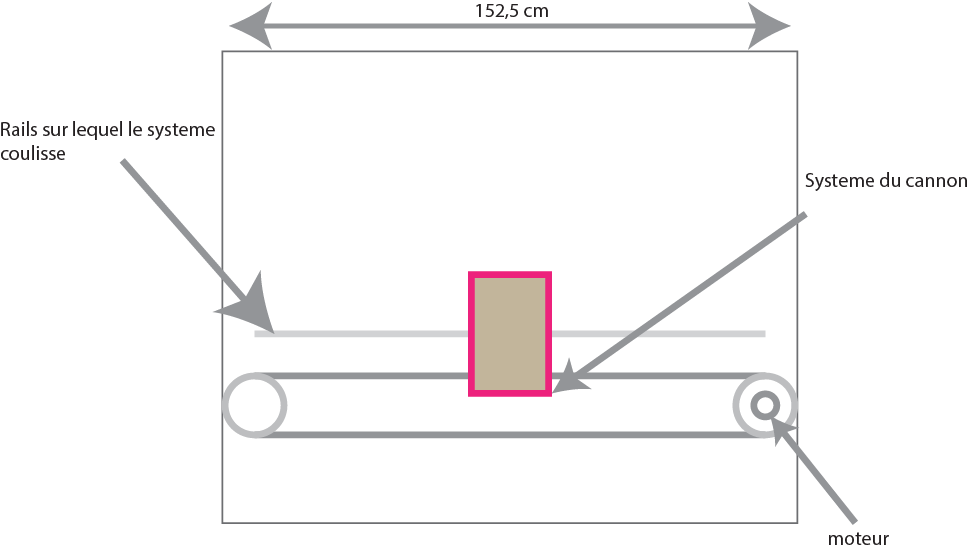

# Rapport de seance du 1/12/2021

## Calcul de la puissance des moteurs

Acceleration du systeme $3 m/s^2$

Vitesse maximale du systeme $0.75 m/s$

Masse du systeme $5kg$ rayon de la poulie: $4cm$

$F = ma = 5*3 = 15N$

$C = F*rayonpoulie = 15*4*10^-2 = 0.6 Nm$

$N_(rad/s) = \frac{v}{rayonpoulie} = 18.75 rad/s$
$P = Ω*C = 18.75*0.6 = 11.25 W$

On comprend donc qu'il nous fera un moteur de 11 W environ pour le stepper motor qui sera responsable de l'axe horizontal

## Les autres moteurs

Par la suite, on a choisi d'utiliser 2 serveaux pour controler le ratotation de la base du cannon.

## préparation de la modélisation 3D

installation et apprentissage du logiciel freeCad
